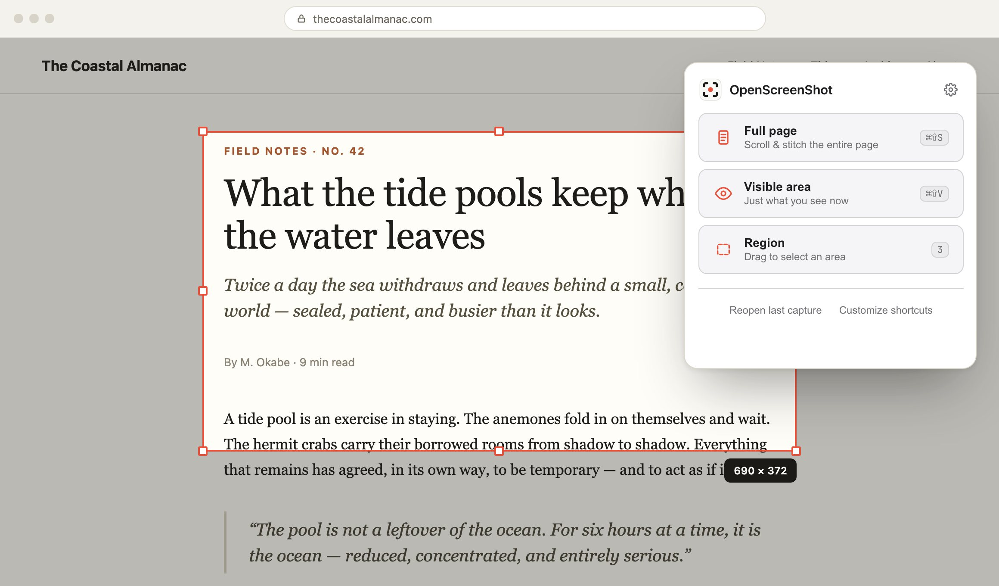
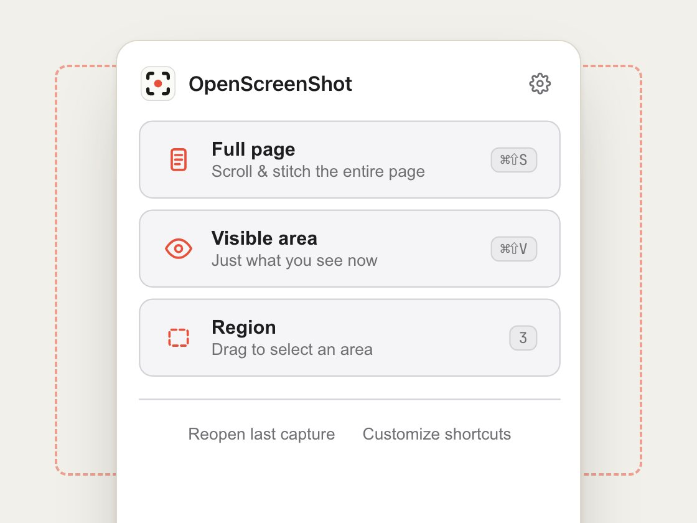
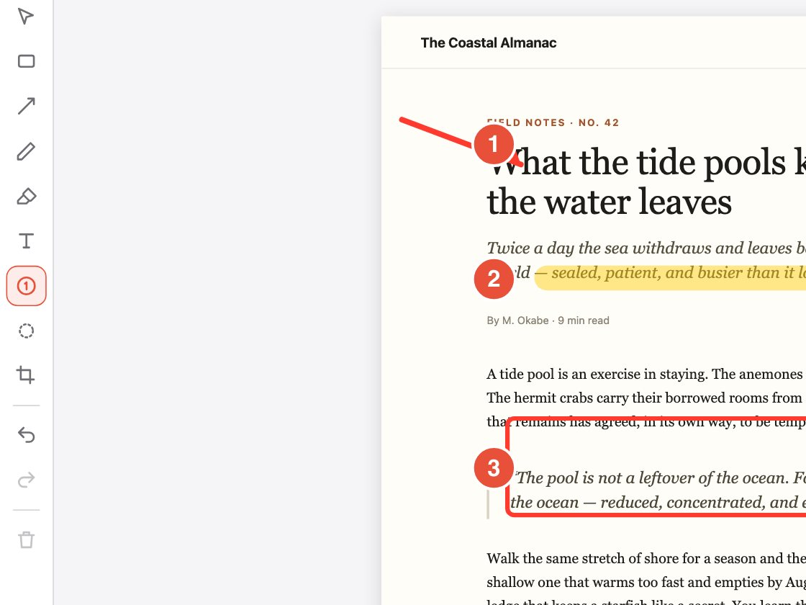
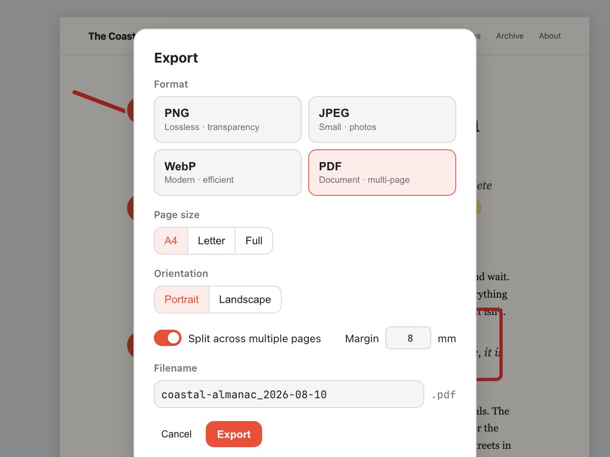

<div align="center">


# OpenScreenShot

**Capture anything. Edit it instantly.**

Open-source full page screenshot extension for Chrome — entire-scrolling-page, region, and
visible-area capture with a built-in annotation editor and PDF export. 100% local and
private: works fully offline, and your screenshots never leave your device.

[](https://chromewebstore.google.com/detail/hdabbojjccojlapnfjpdppcpfcnhgmdp)
[](https://chromewebstore.google.com/detail/hdabbojjccojlapnfjpdppcpfcnhgmdp)
[](https://github.com/pghqdev/OpenScreenShot/actions/workflows/ci.yml)
[](./LICENSE)
[](./manifest.json)

[**➜ Add to Chrome**](https://chromewebstore.google.com/detail/hdabbojjccojlapnfjpdppcpfcnhgmdp) &nbsp;·&nbsp; [Website](https://openscreenshot.app) &nbsp;·&nbsp; [Docs](https://openscreenshot.app/docs/) &nbsp;·&nbsp; [Support](https://openscreenshot.app/support/) &nbsp;·&nbsp; [Roadmap](./ROADMAP.md)



</div>

---

Capture the **entire scrolling page** (scroll-and-stitch), the **visible viewport**, or a
**selected region**. The editor opens on every capture: annotate it, redact it, beautify it,
then export PNG, JPEG, WebP, or a multi-page PDF. Built as a Manifest V3 extension in
TypeScript and Preact, with one runtime dependency.

> [!NOTE]
> There is no server, no account, and no telemetry anywhere in this extension.
> `host_permissions` is empty and it never requests `<all_urls>`. Pull the network cable and
> it works exactly the same.

[Features](#features) &nbsp;·&nbsp; [Install](#install) &nbsp;·&nbsp; [Agents & CLI](#agents--cli) &nbsp;·&nbsp; [Permissions](#permissions) &nbsp;·&nbsp; [Privacy](#privacy) &nbsp;·&nbsp; [Development](#development) &nbsp;·&nbsp; [Contributing](#contributing)

## From page to finished screenshot

|                                        1 · Capture                                        |                                             2 · Edit                                             |                                           3 · Export                                           |
| :---------------------------------------------------------------------------------------: | :----------------------------------------------------------------------------------------------: | :--------------------------------------------------------------------------------------------: |
|  |  |  |
|               One click in the popup, a keyboard shortcut, or keys `1`–`3`                |                   Full-screen editor opens on every capture, undo all the way                    |                   PNG, JPEG, WebP, or multi-page PDF — download or clipboard                   |

## Features

### Capture

- **Full page** — scroll-and-stitch the whole page top to bottom with live progress; fixed headers are composited once at the top. Works on pages that scroll an inner element, too.
- **Visible area** — capture exactly what's on screen right now.
- **Selected region** — click & drag to grab an area, with a Capture/Cancel bar to confirm.
- **Start from anywhere** — the popup, a keyboard shortcut, or the page's right-click menu; repeat the last region in one click.
- **Delayed capture** — hold the shot for 3, 5, or 10 seconds, with a countdown on the badge, for menus and hover states that close when you click.
- **Quick mode** — send a capture straight to the clipboard or straight to disk, skipping the editor.

### Edit

- **Annotation editor** — rectangle, arrow, line, pen, highlighter, text, numbered step badges, blur (soft, mosaic, or solid redaction), spotlight, and crop.
  - Select, move, and resize any annotation; undo and redo all the way back.
  - Hold Shift for squares and 45° lines.
  - Color, stroke width & font size are remembered across sessions.
- **Eyedropper** (`I`) — take a color from the capture, or from anywhere on screen.
- **Any image, not just captures** — drop or paste an image into the editor to annotate it.
- **Beautify** — padding, rounded corners, drop shadow, and a gradient, solid, or transparent background.
- **Crash-safe** — edits are saved locally as you work, and offered back if the tab closes.

### Export

- **Four formats** — PNG, JPEG, WebP, and PDF (single or multi-page with overlap).
- **Straight to clipboard** — `Cmd/Ctrl+C` from the editor.
- **Any scale** — 25 / 50 / 100 / 200 %, or an exact pixel width.

### Around the edges

- **Keyboard-first** — capture shortcuts, number keys `1`–`3` in the popup, `1`–`8` for the editor palette, `?` for the full shortcut sheet, and a "reopen last capture" escape hatch.
- **Settings** — theme, default format, quality, filename template, PDF defaults.
- **Polished & accessible** — dark/light UI, modal focus trap, toolbar arrow-key navigation.

## Install

**From the Chrome Web Store** — [**Add to Chrome**](https://chromewebstore.google.com/detail/hdabbojjccojlapnfjpdppcpfcnhgmdp). That's it.

**From source** — see [Development](#development) below.

> [!TIP]
> Press `?` inside the editor for the full shortcut sheet.

## Agents & CLI

[](https://www.npmjs.com/package/openscreenshot)

`openscreenshot` (npm) is a **separate, optional, local** tool for scripting screenshots from
the command line or from an AI agent. It drives the Chrome already on your machine (no
browser download) and runs entirely on your machine — no account, no hosted service. The
browser extension above is unaffected: it stays a client-side, no-server capture tool.

**Run it** — no install needed:

```bash
npx openscreenshot shot https://example.com --out shot.png --full
```

Set `CHROME_PATH` if your Chrome can't be found automatically.

**MCP server (for agents)** — add to your MCP client config:

```json
{ "command": "npx", "args": ["openscreenshot", "serve"] }
```

Then call the `capture_screenshot` tool with `{ "url": "https://example.com" }`.

Like the extension, this tool runs locally and uploads nothing — it just renders a page and
hands you the PNG.

## Permissions

OpenScreenShot requests the minimum permissions a screenshot tool needs — and explains
every one.

**`host_permissions` is empty.** We never request `<all_urls>` — `activeTab` grants access
on your click, and `scripting` runs only within that grant. The extension cannot read any
site in the background.

<details>
<summary><b>All seven permissions, line by line</b></summary>

<br />

| Permission                       | Why                                                                                                                     |
| -------------------------------- | ----------------------------------------------------------------------------------------------------------------------- |
| `activeTab`                      | Access the current tab — only when you click the extension, use a shortcut, or pick a capture from the right-click menu |
| `scripting`                      | Inject on-demand page functions for scroll-and-stitch, region selection, and the quick-mode clipboard write             |
| `storage` (+ `unlimitedStorage`) | Settings, onboarding state, the last region rect, editing drafts, and stashing large full-page PNGs for the editor      |
| `downloads`                      | Save exports, and quick-mode captures, to your Downloads folder                                                         |
| `contextMenus`                   | Add one capture submenu to the page right-click menu                                                                    |
| `clipboardWrite`                 | Copy a screenshot from the editor or from quick mode; it never reads the clipboard                                      |
| `options_ui`                     | The editor is registered as a full-tab options page so crxjs bundles it; opened after each capture                      |

</details>

## Privacy

**100% local. 100% private. Works fully offline.**

Your screenshots never leave your device — there are no servers, no accounts, no sign-ups,
and no tracking. Every capture, edit, and export happens right inside your browser, so
nothing is ever uploaded, stored in the cloud, or seen by anyone but you. You could pull
the network cable and it would work exactly the same.

Read the full [Privacy Policy](./PRIVACY.md).

## Development

### Tech stack

- **TypeScript** (strict) + **Preact** for the popup/editor UI
- **Vite** + **[@crxjs/vite-plugin](https://github.com/crxjs/crxjs)** for Manifest V3 bundling & HMR
- **Canvas compositing in-page** via on-demand `chrome.scripting` injection (no offscreen document needed)
- **A built-in PDF writer** (`src/editor/pdf-writer.ts`) — it places raster images on pages and deflates them with the browser's own `CompressionStream`. It replaced jsPDF, which pulled in `html2canvas` and `dompurify` for a `doc.html()` path the editor never called.
- **One runtime dependency in the extension**: Preact. Everything else is browser API.
- **Vitest** for unit tests (`tests/unit`, plus `mcp/test` for the CLI and server)

### Quick start

Node.js 22+ and npm 10+ required.

```bash
npm install
npm run icons      # generate the extension icons into public/icons
npm run dev        # start Vite + crxjs with HMR (writes to dist/)
```

Then load the extension in Chrome:

1. Open `chrome://extensions`
2. Enable **Developer mode** (top right)
3. Click **Load unpacked** and select the `dist/` folder

### Build for production

```bash
npm run build      # type-check + bundle into dist/
```

Load `dist/` as an unpacked extension, or run `npm run package` to produce
`openscreenshot-vX.Y.Z.zip` for the Chrome Web Store.

<details>
<summary><b>All npm scripts</b></summary>

<br />

| Script                | Description                                         |
| --------------------- | --------------------------------------------------- |
| `npm run dev`         | Vite dev server with extension HMR                  |
| `npm run build`       | Type-check and bundle the extension into `dist/`    |
| `npm run typecheck`   | Run `tsc --noEmit`                                  |
| `npm run lint`        | ESLint (flat config)                                |
| `npm test`            | Run unit tests (Vitest)                             |
| `npm run icons`       | Regenerate extension icons from the SVG source      |
| `npm run shots`       | Re-render the marketing screenshots (`docs/assets`) |
| `npm run format`      | Format the codebase with Prettier                   |
| `npm run package`     | Build + zip `dist/` for store submission            |
| `npm run site:dev`    | Serve `docs/` locally through the Worker            |
| `npm run site:deploy` | Deploy `docs/` to openscreenshot.app                |

</details>

<details>
<summary><b>Project structure</b></summary>

<br />

```
openscreenshot/
├── manifest.json            # MV3 manifest (crxjs entry)
├── public/
│   ├── icons/               # generated extension icons
│   └── _locales/en/         # i18n messages
├── src/
│   ├── background/          # service worker (capture coordinator)
│   ├── content/             # on-demand capture funcs (scroll, region)
│   ├── editor/              # annotation editor + export (Preact, own tab)
│   ├── popup/               # popup UI (Preact)
│   └── shared/              # design tokens, messaging, storage, types, utils
├── mcp/                     # optional local CLI + MCP server
├── docs/                    # openscreenshot.app, served by site-worker.js
├── tests/unit/              # unit tests (Vitest)
└── scripts/
    ├── generate-icons.mjs   # SVG → PNG/ICO icon pipeline
    └── shots/               # marketing screenshot pipeline (npm run shots)
```

</details>

## Contributing

Contributions are welcome! See [CONTRIBUTING.md](./CONTRIBUTING.md). Please follow the
[Code of Conduct](./CODE_OF_CONDUCT.md). Curious what's next? Check the
[public roadmap](./ROADMAP.md).

<div align="center">

## Support the project

OpenScreenShot is free and open source. If you find it useful, consider supporting its
development — every coffee helps!

[](https://ko-fi.com/T7A624DAY7)

</div>

## License

[MIT](./LICENSE) © OpenScreenShot @PGHQdev
