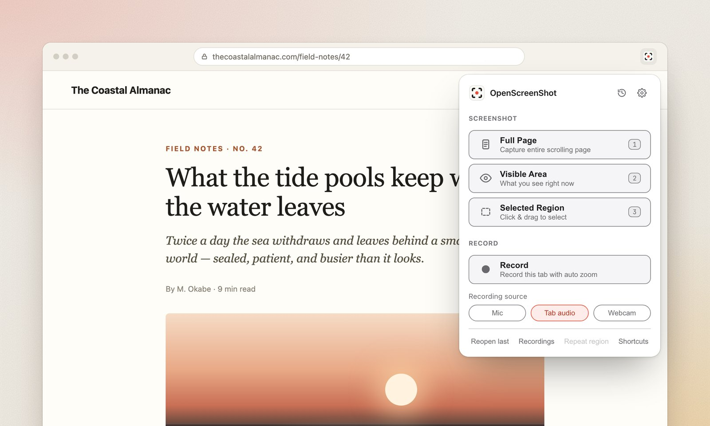

<div align="center">


# OpenScreenShot

**The whole page. One click. Yours to keep.**

Full-page screenshots for Chrome and Firefox. Free editing. Local processing. No account.

[](https://github.com/pghqdev/OpenScreenShot/actions/workflows/ci.yml) [](./LICENSE) [](https://chromewebstore.google.com/detail/hdabbojjccojlapnfjpdppcpfcnhgmdp) [](https://addons.mozilla.org/firefox/addon/openscreenshot/)

<br />

<table>
<tr>
<td align="center" width="280">
<a href="https://chromewebstore.google.com/detail/hdabbojjccojlapnfjpdppcpfcnhgmdp">
<br />
<strong>Add to Chrome</strong>
</a><br />
<sub>Chrome · Edge · Brave · Arc</sub>
</td>
<td align="center" width="280">
<a href="https://addons.mozilla.org/firefox/addon/openscreenshot/">
<br />
<strong>Add to Firefox</strong>
</a><br />
<sub>Firefox for desktop · 140+</sub>
</td>
</tr>
</table>

[Website](https://openscreenshot.app) &nbsp;·&nbsp; [Docs](https://openscreenshot.app/docs/) &nbsp;·&nbsp; [Roadmap](./ROADMAP.md) &nbsp;·&nbsp; [Report a bug](https://github.com/PGHQdev/OpenScreenShot/issues)

<br />



<sub>Chrome preview. Screenshot capture and editing are also available in Firefox.</sub>

</div>

Capture a scrolling page, mark up what matters, and share an image or PDF.
Screenshots and edits stay on your device. No uploads, watermarks, or paid editing tools.

## Capture → edit → share

- **One click, whole page** — the toolbar icon captures the entire scrolling page,
  even behind sticky headers and inside nested scrollers (a settings toggle restores
  the mode picker)
- **Visible area and region capture** from the right-click menu or shortcuts
- **Annotate** with arrows, text, numbered steps, spotlight, and crop, with full undo
- **Blur or redact secrets** before you share
- **Record the tab in Chrome** with auto-zoom at your clicks, mic and webcam, and trim
- **Export** as PNG, JPEG, WebP, or multi-page PDF, or copy straight to the clipboard

The full tour, every shortcut, and the settings reference live in the
[docs](https://openscreenshot.app/docs/).

## Install

|                                          | Chrome & Chromium                                                                             | Firefox                                                                     |
| ---------------------------------------- | --------------------------------------------------------------------------------------------- | --------------------------------------------------------------------------- |
| Install                                  | [Chrome Web Store](https://chromewebstore.google.com/detail/hdabbojjccojlapnfjpdppcpfcnhgmdp) | [Firefox Add-ons](https://addons.mozilla.org/firefox/addon/openscreenshot/) |
| Full-page, visible-area & region capture | ✓                                                                                             | ✓                                                                           |
| Annotations, redaction & local history   | ✓                                                                                             | ✓                                                                           |
| Image, PDF & clipboard export            | ✓                                                                                             | ✓                                                                           |
| Screen recording                         | Chrome                                                                                        | Not available                                                               |

Firefox requires **desktop version 140 or later**. The Chrome extension also works in
Edge, Brave, Arc, and other Chromium browsers. Screen-wide color picking and floating
capture windows appear only when the browser supports them.

### Your first screenshot

1. **Install** from your browser’s store and pin the extension to the toolbar.
2. **Click the icon** to capture the whole page. Right-click for visible-area and region capture.
3. **Edit and share** — annotate, redact, copy, or save an image or PDF.

Prefer a capture menu on every click? Turn off **Express mode** in settings.
For alternatives and a sourced feature comparison, see [How it compares](https://openscreenshot.app/compare/).

## Private by design

`host_permissions` is empty: `activeTab` grants access on your click, and the extension
does not have standing access to every website. Captures, recordings, and edits stay
in local browser storage until you export or delete them. Chrome can optionally request
broader access for recording across sites; Firefox does not request recording permissions. Full policy: [PRIVACY.md](./PRIVACY.md).

<details>
<summary><b>Every permission, line by line</b></summary>

<br />

| Permission                           | Why                                                                                                                                            |
| ------------------------------------ | ---------------------------------------------------------------------------------------------------------------------------------------------- |
| `activeTab`                          | Access the current tab — only when you click the extension, use a shortcut, or pick a capture from the right-click menu                        |
| `scripting`                          | Inject on-demand page functions for scroll-and-stitch, region selection, the quick-mode clipboard write, and the in-page recording control bar |
| `storage` (+ `unlimitedStorage`)     | Settings, the last region rect, editing drafts, a parked Record click, and stashing large full-page PNGs and recording chunks for the editor   |
| `downloads`                          | Save exports, quick-mode captures, and recording exports to your Downloads folder                                                              |
| `contextMenus`                       | Add one capture submenu to the page right-click menu                                                                                           |
| `clipboardWrite`                     | Copy a screenshot from the editor or from quick mode; it never reads the clipboard                                                             |
| `offscreen` (Chrome)                 | Run the recording engine in a hidden document — `MediaRecorder` and the IndexedDB writes need a page context a service worker doesn't have     |
| `tabCapture` (Chrome, optional)      | Requested once, at your first recording; every recording after that starts in one click                                                        |
| `<all_urls>` (Chrome, optional host) | Only if you turn on "Record across sites" — keeps the cursor overlay alive when a recording navigates to a new origin                          |

</details>

## Development

TypeScript (strict) + Preact, bundled by Vite + [@crxjs/vite-plugin](https://github.com/crxjs/crxjs).
One runtime dependency (Preact); unit tests with Vitest. Node.js 22.19+ and pnpm 10.33.0.

```bash
pnpm install --frozen-lockfile
pnpm run icons
```

|              | Chrome                                                                   | Firefox                                                                                         |
| ------------ | ------------------------------------------------------------------------ | ----------------------------------------------------------------------------------------------- |
| Develop      | `pnpm run dev`                                                           | `pnpm run dev:firefox`                                                                          |
| Build        | `pnpm run build`                                                         | `pnpm run build:firefox`                                                                        |
| Package      | `pnpm run package`                                                       | `pnpm run package:firefox`                                                                      |
| Load locally | `chrome://extensions` → **Developer mode** → **Load unpacked** → `dist/` | `about:debugging` → **This Firefox** → **Load Temporary Add-on** → `dist-firefox/manifest.json` |

```bash
pnpm typecheck
pnpm lint
pnpm test
pnpm format:check
pnpm lint:firefox   # validate dist-firefox/ after building
```

The [Firefox release guide](release/firefox/README.md) covers reviewer source archives,
verification, and automated Mozilla submissions. Tagged releases have separate Chrome
and Firefox workflows; store review determines when each update becomes available.

For the website, use `pnpm site:dev` or `pnpm site:deploy`. See
[CONTRIBUTING.md](./CONTRIBUTING.md) for the contribution workflow.

<details>
<summary><b>Project structure</b></summary>

<br />

```
openscreenshot/
├── manifest.json            # MV3 manifest (crxjs entry)
├── public/                  # icons + i18n messages
├── src/
│   ├── background/          # service worker (capture + recording coordinator)
│   ├── content/             # on-demand capture funcs (scroll, region, recording overlay)
│   ├── editor/              # annotation editor + export (Preact, own tab)
│   ├── offscreen/           # recording engine: MediaRecorder + IndexedDB chunks
│   ├── popup/               # popup UI (Preact)
│   ├── recorder/            # recording editor: timeline, zoom, trim, export (Preact, own tab)
│   └── shared/              # design tokens, messaging, storage, types, utils
├── mcp/                     # optional local CLI + MCP server
├── site/                    # Astro website + localized content
├── docs/                    # generated site build, served by site-worker.js
├── tests/unit/              # unit tests (Vitest)
└── scripts/                 # icon + screenshot pipelines
```

</details>

## Screenshots from the CLI or an agent

[](https://www.npmjs.com/package/openscreenshot)

`openscreenshot` (npm) is a separate, optional tool that drives the Chrome already on your
machine — also fully local:

```bash
pnpm dlx openscreenshot shot https://example.com --out shot.png --full
```

As an MCP server, add `{ "command": "pnpm", "args": ["dlx", "openscreenshot", "serve"] }` to your
client config and call the `capture_screenshot` tool.

Built for the terminal-heavy parts of the job:

- **DevOps** — snapshot dashboards, status pages, and admin UIs straight into incident
  reports, runbooks, and postmortems, from cron or a chat command
- **CI/CD** — capture pages in your pipeline for docs, release notes, and visual diffs
  on every deploy: one command, no hosted service

## Contributing

Desktop and web apps are also in progress. Follow their development on the
[roadmap](./ROADMAP.md).

See [CONTRIBUTING.md](./CONTRIBUTING.md) and the [roadmap](./ROADMAP.md). If
OpenScreenShot is useful to you, you can [buy me a coffee](https://ko-fi.com/T7A624DAY7).

## License

[MIT](./LICENSE) © OpenScreenShot @PGHQdev
